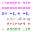
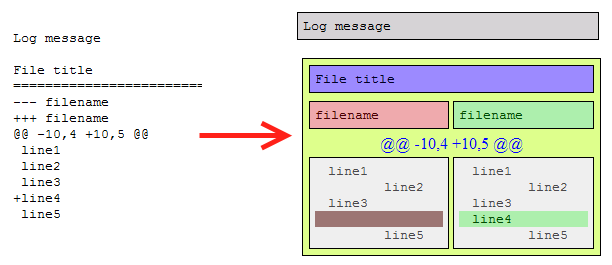

#  Colored diffs

This is an extension that colors boring diffs sent by notifiers for Git,
Subversion, CVS, Mercurial, etc.

The project was originally authored by Vadim Atlygin, and for a time it has
been maintained by Jesse Glick (jglick). Now the torch has passed to Qeole.

## Presentation

A lot of developers use Git or other version control systems. Most of them also
receive special notifications from the system about changes other people do.
They might be useful in various ways: someone wants to check if there are bugs
in the new code, someone just wants to keep knowledge of code base up-to-date.
But looking over that black-on-white letter is so boring. That's why we decided
to color it up a bit.

## Installation

### Get it from Mozilla add-ons platform…

[Available here](https://addons.mozilla.org/en-US/thunderbird/addon/colored-diffs/)

### … Or install it manually

[Install locally](https://developer.mozilla.org/en-US/Add-ons/Thunderbird/Building_a_Thunderbird_extension_7:_Installation)
or
[package it into a .xpi file](https://developer.mozilla.org/en-US/Add-ons/Thunderbird/Building_a_Thunderbird_extension_8:_packaging).

Under UNIX-like systems you can create the .xpi file by simply running:

    $ cd /path/to/colorediffs/
    $ make

## What the add-on can do

Well, not so much… It can color your diffs, it can show them in side-by-side
mode if you like. Also it converts all the filenames in message log into links
so you can quickly jump to the file you want to review. Ah, and it can make
space and tabs chars visible. You can look through list of SupportedFormats to
see what are the supported VCSs.

## Ideas for future contribution

The original author of the project wanted this add-on to include the following
features:

  1. Highlighting the actual difference between the lines.
  2. Coloring the syntax of the language used.
  3. Checking new code against few rules in order to estimate the quality of
     it.

But these are pretty big tasks, and development of the add-on is not so active
by now. If you want to help, though, do not hesitate to contribute by dropping
an issue or a PR!

## Contribution

If you know how to do something better, whether it's code, icons, default color
scheme, just contact me. Also please visit the [issues
list](https://github.com/jglick/colorediffs/issues) and comment on issues you'd
really like to be done first.

## Firefox extension

There isn't one and probably never will be, sorry. I could make it work for
diff in `<pre>` sections (most mail lists archives format them like this) but
it would never work in GMail and other Web mail systems where it would be
actually useful. It's just plain hard to find the code between the lines of
normal text. But you could ease you pain with [Bookmarklet](Bookmarklet.md) I
wrote when your needs is simple (like mail list archives) and [GreaseMonkey
script](http://userscripts.org/scripts/show/26684) written by Fabrice
Bellingard for GMail. Thanks for understanding.

## Version notes

* Version 0.5 is the last one with support for Thunderbird 2. I'm too tired of
  more than two years old JavaScript engine.

* Version 0.7 does not support SeaMonkey anymore, because the new maintainer
  does not use it and does not wish to test add-on compatibility. But the code
  has not changed much, and this is probably just a matter of enabling support
  again in install.rdf file. So if some tech-savvy SeaMonkey user tests and
  confirms compatibility, I will enable it again.

* Version 0.8+ should work with Thunderbird 60 (although I did not manage to
  fix preferences settings, so it comes with fixed color choices, unless users
  resort to the editor config). Later Thunderbird versions are expected to
  deprecate XUL-based extensions, which means the add-on will not remain
  compatible unless it undergoes major rework.
