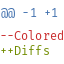

#  Colorediffs

Color diffs in the emails you receive. This is typically helpful for reviewing
patches formatted with Git or other version control systems.

## Installation

### Get it from Thunderbird's Add-Ons Platform…

[Available here](https://addons.thunderbird.net/en-US/thunderbird/addon/colored-diffs/)

### … Or Install it Manually

Pack the add-on as an .xpi file and install it from the “gear” menu in
Thunderbird's add-on manager.

On UNIX-like systems, you can create the .xpi file by simply running:

    $ cd /path/to/colorediffs/
    $ make

Note that this will download (with curl) the latest version of the highlight.js
library, which is not included in this repository.

## Usage

Once installed, the add-on should automatically detect diffs in your plain-text
messages and color them with the selected theme. Some options are available in
the add-on preference page:

- You can select the color scheme amongst all the styles supported by
  highlight.js.
- You can have tabs and white space characters replaced by visible characters.
- You can set the length for tab characters (defaults to 8).
- You can choose to color all plain-text messages (even with no diffs), which is
  mostly useful to avoid visual discomfort when using a style with a dark
  background and browsing a mailing list.

## Versions

**Version 2+ of the add-on is compatible with Thunderbird stable version 78.4
and onward.** It uses the `messageDisplayScripts` API which was added in
Thunderbird 82, and backported to 78.4.

Older versions of the add-on work with Thunderbird
[up to the version 68](https://github.com/Qeole/colorediffs/tree/e51d1aab6390d11a5ee2ec84e1cf42fd08564a41#version-notes).

The distinction is due to Thunderbird's move to MailExtensions. As a
consequence of this change, version 2.0.0 of the add-on is a complete rewrite
(by Qeole) and works differently from the previous versions. Instead of parsing
the diffs and rebuilding the messages itself, the add-on embeds and injects the
[highlight.js library](https://highlightjs.org/) which takes care of the
colors, without reformatting the content of the message.

## Status

The project was originally authored by Vadim Atlygin. For a time it has
been maintained by Jesse Glick (jglick), and it has now passed to Qeole.

This add-on is mostly in maintenance mode, do not expect new features. Several
people are using it to review patches for their daily jobs, so the objective is
essentially to keep something basic, but that works.

Nonetheless, you are welcome to report issues or to submit pull requests.
