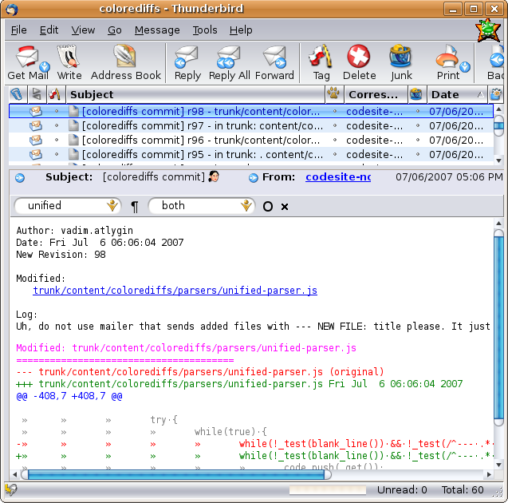
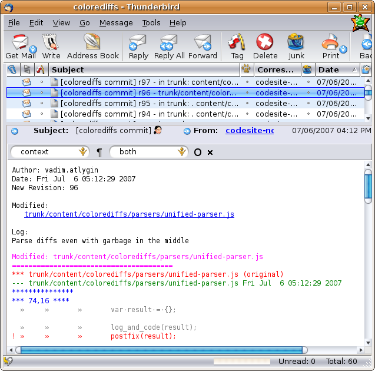
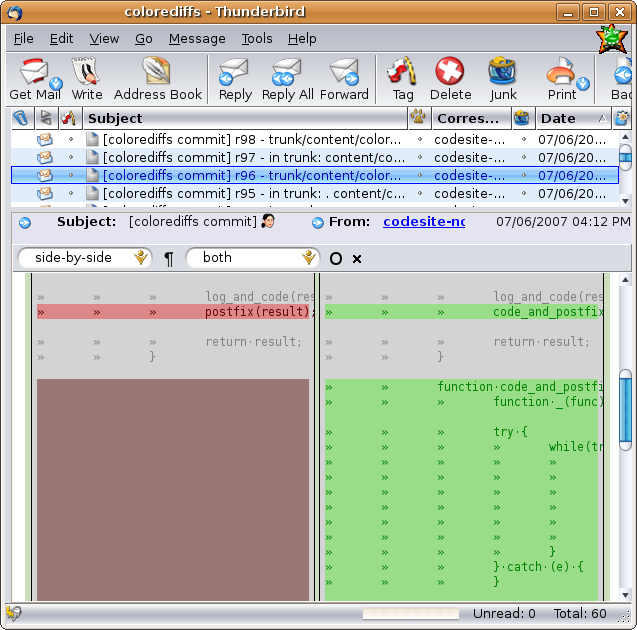
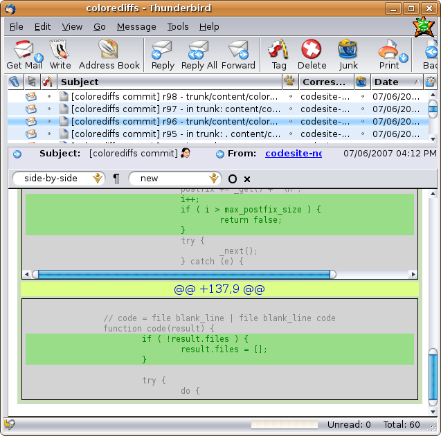
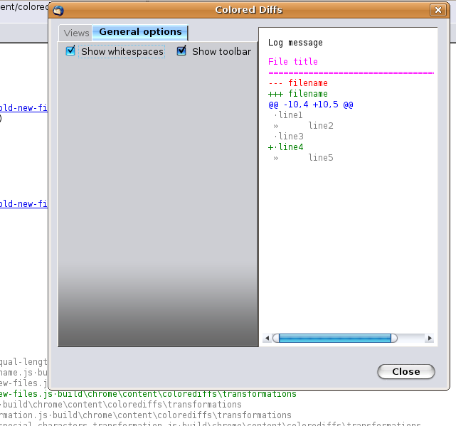

# Various screenshots of extension #

_Boring colorless standard view of diff file_

_Lightweight unified view mode_

_Lightweight context view mode_

_Heavy and colorful side-by-side view mode_

_Side-by-side view mode shown how new file would look like_

_Side-by-side view mode without visible whitespaces_

_Settings dialog for unified view mode_

_Settings dialog for context view mode_

_Settings dialog for side-by-side view mode_

_General settings dialog_

